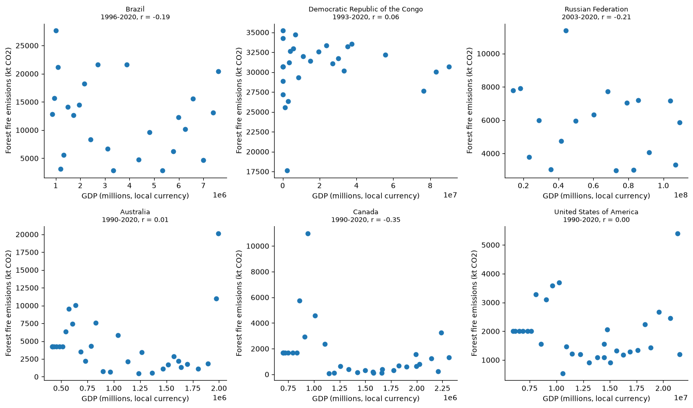

# tdd

Combines the Agrofood CO2 emission and IMF
GDP data sets by country and year, then plots forest fire emissions
against GDP for several countries. Written with test driven development.

## Installation

```
git clone <your fork of this repo>
cd tdd
mamba env create -f environment.yml
mamba activate swe4s
```

Download the data (not tracked by git):

```
mkdir -p data
curl -L "https://docs.google.com/uc?export=download&id=1AsXP_OGs1O_TDeXiZjk3fYV1SrG4vwXF" -o data/Agrofood_co2_emission.csv
curl -L "https://docs.google.com/uc?export=download&id=19YEPysdnK7VCXuAe9Og9pwYkNT5CbQzr" -o data/IMF_GDP.csv
```

## Usage

`src/fire_gdp.py` is a library:

- `get_data(file_name, query_column=None, query_value=None, return_header=False)`
  returns the rows of a CSV file, optionally only those where column
  `query_column` equals `query_value`, and optionally the header.
- `get_column_index(header, column_name)` returns the position of
  `column_name` in `header`, or `None` if it is absent.
- `get_fire_gdp_year_data(co2_file, gdp_file, country)` returns
  `[year, forest_fires, gdp]` for every year with both values present.

```
>>> import fire_gdp
>>> fire_gdp.get_fire_gdp_year_data('data/Agrofood_co2_emission.csv',
...                                 'data/IMF_GDP.csv', 'Brazil')[9]
[2005, 18253.5232, 2170584.5]
```

`src/plot_fire_gdp.py` makes one scatter plot per country:

```
usage: plot_fire_gdp.py [-h] [--co2_file CO2_FILE] [--gdp_file GDP_FILE]
                        [--countries COUNTRIES [COUNTRIES ...]] --out OUT
```

- `--co2_file` defaults to `data/Agrofood_co2_emission.csv`
- `--gdp_file` defaults to `data/IMF_GDP.csv`
- `--countries` defaults to the six countries below; names must match both
  files exactly (e.g. `"United States of America"`)
- `--out` is the output image (required)

Countries with fewer than two matching years are skipped with a message. A
missing input file exits with code 1.

```
python src/plot_fire_gdp.py --countries Brazil Canada --out brazil_canada.png
```

## Testing

```
python test/unit/test_fire_gdp.py
bash test/func/test_fire_gdp.sh
```

Tests use the small files in `test/data`.

## Forest fires and GDP

### Introduction

Does a country's forest fire CO2 emissions track its economy? I paired yearly
forest fire emissions (kilotonnes CO2) with yearly GDP for six countries with
large forest fire emissions: Brazil, the Democratic Republic of the Congo,
Russia, Australia, Canada, and the United States. GDP is in millions of each
country's own currency, so each country is analyzed on its own.

### Results



No country shows a meaningful relationship between GDP and forest fire
emissions. Pearson correlations range from -0.35 (Canada) to 0.06 (DR Congo),
with Brazil, Russia, Australia and the US between -0.21 and 0.01. Fire
emissions vary a lot from year to year while GDP rises steadily, so the
largest points are single extreme fire seasons (Australia's 2019 Black
Summer, Canada's 1998 season, the US in 2020) rather than a trend. Note that
for Australia, Canada and the US the 1990-1995 fire values are identical, which
suggests they are filled-in values, not measurements. GDP here is nominal, so
part of its growth is inflation; with these data, GDP is mostly a proxy for
time.

### Methods

1. Downloaded both data sets (see Installation).
2. For each country, `get_fire_gdp_year_data` takes the `Forest fires` value
   from each of the country's rows in the CO2 file, looks up that row's year
   in the GDP header, and takes the country's GDP for that year. Years with a
   missing fire or GDP value are dropped.
3. `plot_fire_gdp.py` plots GDP (x) against fire emissions (y) for each
   country and reports the year range and Pearson's r in each panel title.

To reproduce the figure:

```
python src/plot_fire_gdp.py --out doc/fire_gdp.png
```
